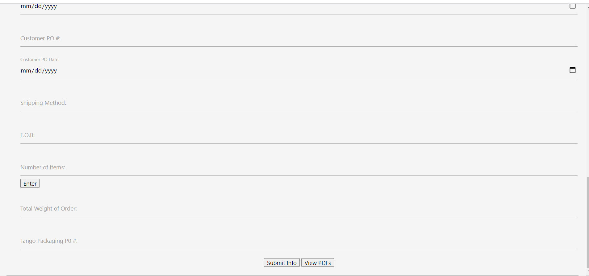

# Tango-Packaging

### Description

This repository contains a web application that allows the user (Tango-Packaging employees) to generate shipping label PDFs based off of the values inputed in the form on the webpage.  This method of label generation takes the load off of Tango-Packaging employees who had to generate the forms manually up until the inception of this application.  The application was created using HTML to display the form elements and styled using the CSS framework materializecss.  Javascript was also incorporated to add on-click functionality to the buttons on the webpage and for the proper utilization of PDF generation APIs.  

Link to deployed application here: [Tango-Packaging Label Generator](https://coryfay.github.io/tango-packaging/)

### Usage

To use this application, simply input the appropriate values into the input fields and submit this form data with the "submit info" button.  Then, click the "view PDFs" button to open a separate webpage with the generated PDFs and clicking the "download PDf" button will download the selected PDF 

### Credits

### License

MIT License

Copyright (c) [2020] [Armando Contreras, Cory Fay, Joe Giampaoli, Ryan Petrecca]

Permission is hereby granted, free of charge, to any person obtaining a copy
of this software and associated documentation files (the "Software"), to deal
in the Software without restriction, including without limitation the rights
to use, copy, modify, merge, publish, distribute, sublicense, and/or sell
copies of the Software, and to permit persons to whom the Software is
furnished to do so, subject to the following conditions:

The above copyright notice and this permission notice shall be included in all
copies or substantial portions of the Software.

THE SOFTWARE IS PROVIDED "AS IS", WITHOUT WARRANTY OF ANY KIND, EXPRESS OR
IMPLIED, INCLUDING BUT NOT LIMITED TO THE WARRANTIES OF MERCHANTABILITY,
FITNESS FOR A PARTICULAR PURPOSE AND NONINFRINGEMENT. IN NO EVENT SHALL THE
AUTHORS OR COPYRIGHT HOLDERS BE LIABLE FOR ANY CLAIM, DAMAGES OR OTHER
LIABILITY, WHETHER IN AN ACTION OF CONTRACT, TORT OR OTHERWISE, ARISING FROM,
OUT OF OR IN CONNECTION WITH THE SOFTWARE OR THE USE OR OTHER DEALINGS IN THE
SOFTWARE.
